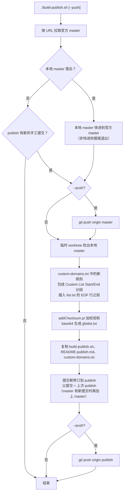
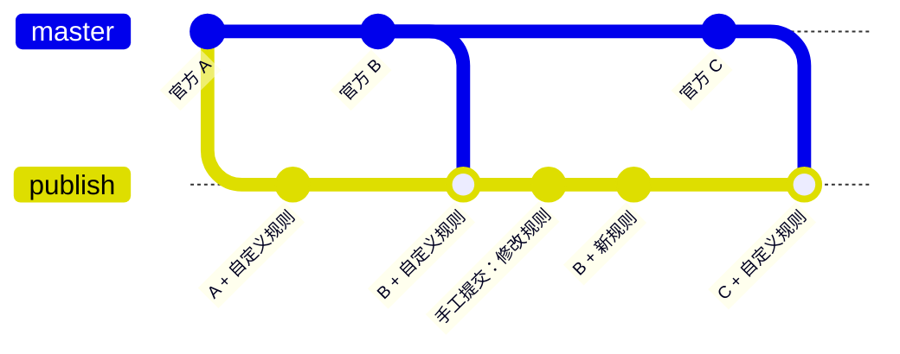

# publish 分支

`publish` 分支 = 官方 [gfwlist/gfwlist](https://github.com/gfwlist/gfwlist) 的 master + 自定义规则，
由 `build-publish.sh` 生成，可直接作为 GFWList 订阅地址使用。

## 订阅地址

```
https://raw.githubusercontent.com/uglykitty/gfwlist/publish/gfwlist.txt
```

## 文件说明

| 文件 | 说明 |
|---|---|
| `custom-domains.txt` | 自定义规则，每行一条 GFWList 规则；空行和以 `!` 开头的注释行会被忽略 |
| `build-publish.sh` | 快进 master 到官方 master、合并自定义规则、生成 `gfwlist.txt` 并提交到 `publish` |
| `list.txt` | 官方 `list.txt` 加上自定义规则（包在 `Custom List Start/End` 分段之间，插在 EOF 注释行之前，已存在的规则会跳过） |
| `gfwlist.txt` | 由 `list.txt` 加上校验和后 base64 编码生成，即订阅内容 |
| `README-publish.md` | 本说明 |

除以上文件外，其余内容均与官方 master 一致，请勿直接在 `publish` 上修改其他文件，下次构建会被覆盖。

## 用法

添加或修改自定义规则：

```bash
git checkout publish
vim custom-domains.txt            # 例如添加一行 ||example.com
git commit -am "Add example.com"
./build-publish.sh --push
```

仅同步官方最新规则：

```bash
./build-publish.sh --push
```

不带 `--push` 时只在本地生成提交，不推送。
只有本地 `master` 落后于官方 master，或 `publish` 上有新的手工提交时才会处理，否则直接结束。

## 脚本行为



提交历史的形状（每次构建一个新修订，`publish` 始终快进）：



官方有更新时，新提交以 [上次 publish, master] 为父提交，把官方提交并入；
只有 publish 上的手工提交时，新提交直接接在后面，历史保持直线。

1. 按 URL 直接拉取官方 master（不添加 remote）。本地 `master` 不落后，且 `publish` 最新提交仍是脚本生成的
   （没有新的手工提交）时直接结束；
   落后时把本地 `master` 快进过去，非快进时由 git 拒绝并报错退出，不会强推。
   `--push` 时立即把 `master` 推送到 `origin`。此后只以本地 `master` 为基础，与官方仓库无关。
2. 在临时 worktree 中基于本地 `master` 合并自定义规则，生成 `gfwlist.txt`。
   `Last Modified` 取 `master` 的提交时间，`master` 无更新时结果可重复。
3. 以新修订提交到 `publish`：父提交为上次的 publish；master 有 publish 尚未包含的提交时再加上 master。
   两种情况推送都是快进。
   进入这一步就会产生新提交，即使生成的内容没有变化。
4. `--push` 时推送 `publish`。

在 `publish` 分支上运行时，工作区必须干净（先提交 `custom-domains.txt` 等改动）。

## 各步骤使用的命令

变量取默认值：`$MASTER`=master，`$PUBLISH`=publish，`$REMOTE`=origin。

**第 0 步：参数与环境检查**

| 步骤 / 判断 | 命令 | 说明 |
|---|---|---|
| 解析参数 | `for arg in "$@"; case ... esac` | 只接受 `--push`，其他参数打印用法后以退出码 1 结束 |
| 依赖工具是否齐全 | `command -v date file git openssl perl` | 缺任何一个就报错退出 |
| 必需文件是否存在 | `[ -f custom-domains.txt ]`、`[ -f README-publish.md ]` | 缺文件就报错退出 |
| 子模块是否已初始化 | `[ -f apollyon/addChecksum.pl ]`，没有则 `git submodule update --init apollyon` | 后面加校验和要用到它 |

**第 1 步：判断是否需要处理，并同步 master**

| 步骤 / 判断 | 命令 | 说明 |
|---|---|---|
| 拉取官方 master | `git fetch -q <官方URL> master` | 不添加 remote，结果只记在 `FETCH_HEAD` |
| 记下官方提交 | `UPSTREAM=$(git rev-parse FETCH_HEAD)` | 后面的 fetch 会覆盖 FETCH_HEAD，所以先存到变量里 |
| 本地 master 是否存在 | `git rev-parse -q --verify refs/heads/master` | 不存在时视为落后，会新建 |
| **master 是否落后** | `git merge-base --is-ancestor $UPSTREAM refs/heads/master` | 成功表示 master 已包含官方提交（不落后）；失败表示落后（或已分叉） |
| **publish 有新的手工提交** | `git rev-parse -q --verify refs/heads/publish`<br>`[ "$(git log -1 --format=%s refs/heads/publish)" = "$MSG" ]` | 取 publish 最新提交的标题，与 `$MSG`（`gfwlist + custom rules`）比较：相同说明是脚本生成的，没有新提交；否则说明有手工提交。publish 分支不存在时也视为需要处理 |
| 都不满足时结束 | `echo "... nothing to do."` 加 `exit 0` | 退出码 0 |
| 当前是否在 master 上 | `git symbolic-ref -q --short HEAD` | 决定下一步用哪种方式快进 |
| 快进 master（在 master 上） | `git merge -q --ff-only $UPSTREAM` | 不能快进时输出 `cannot be fast-forwarded`，以退出码 1 结束 |
| 快进 master（不在 master 上） | `git fetch -q . $UPSTREAM:refs/heads/master` | 从本仓库自身 fetch 来更新分支引用；git 默认拒绝非快进 |
| 推送 master（`--push`） | `git push origin master` | 普通推送，非快进时会被远程拒绝 |
| 确定构建基础 | `BASE=$(git rev-parse refs/heads/master)` | 之后只以本地 master 为准 |

**第 2 步：在临时 worktree 中合并自定义规则**

| 步骤 / 判断 | 命令 | 说明 |
|---|---|---|
| 创建临时目录 | `mktemp -d`，并设置 `trap cleanup EXIT` | 脚本退出时自动执行 `git worktree remove --force` 和 `rm -rf` |
| 检出 master | `git worktree add -q --detach $work/wt $BASE` | 以分离 HEAD 方式检出，不占用任何分支 |
| 读取规则 | `grep -v '^[[:space:]]*$'`，再 `grep -v '^!'` | 去掉空行和以 `!` 开头的注释 |
| 跳过已有规则 | `grep -qxF -- "$rule" list.txt` | 整行精确匹配，已存在的规则不再添加 |
| 定位 EOF 行 | `grep -n '^!-*EOF-*$' list.txt`，再 `tail -1`、`cut -d: -f1` | 取最后一个 EOF 注释行的行号 |
| 插入自定义分段 | `head -n $((eof-1))`、`cat` 新分段、`tail -n +$eof` | 新规则包在 `Custom List Start/End` 之间，插在 EOF 行之前 |

**第 3 步：生成 gfwlist.txt**

| 步骤 / 判断 | 命令 | 说明 |
|---|---|---|
| 固定修改时间 | `touch -d "@$(git log -1 --format=%ct $BASE)"` | `Last Modified` 取 master 的提交时间，结果可重复 |
| 加校验和 | `perl apollyon/addChecksum.pl check.txt` | 在副本上执行，不改动 list.txt |
| 检查是否为纯 ASCII | `file -b check.txt`，结果交给 `grep -o "ASCII text"` | 有非 ASCII 字符或 CRLF 换行时报错退出 |
| base64 编码 | `openssl base64 -in check.txt`，再用 `tr -d '\r'` 去掉回车 | 输出为 gfwlist.txt |

**第 4、5 步：生成提交**

| 步骤 / 判断 | 命令 | 说明 |
|---|---|---|
| 复制随附文件 | `cp -p build-publish.sh`、`cp README-publish.md`、`cp custom-domains.txt` | 使 publish 分支可以独立运行脚本 |
| 写入树对象 | `git add ...`，然后 `git write-tree` | 只生成树，不切换分支 |
| 确定父提交 | `git rev-parse refs/heads/publish`<br>`git merge-base --is-ancestor $BASE refs/heads/publish` | 父提交为上次的 publish；master 不是 publish 的祖先（有新提交）时再加上 master，否则保持直线。publish 不存在时只以 master 为父提交 |
| 创建提交 | `git commit-tree $tree -p <publish> -p <master> -m "$MSG"` | 直接生成提交对象，不经过 index 和 HEAD |
| 是否在 publish 上运行 | `git -C $root symbolic-ref -q --short HEAD` | 决定下一步用哪种方式更新分支 |
| 更新 publish（在 publish 上） | `git -C $root diff --quiet HEAD`，然后 `git reset -q --hard $commit` | 工作区不干净时报错退出 |
| 更新 publish（不在 publish 上） | `git update-ref refs/heads/publish $commit` | 直接移动分支指针 |

**第 6 步：推送**

| 步骤 / 判断 | 命令 | 说明 |
|---|---|---|
| 推送 publish（`--push`） | `git push origin publish` | 新提交以上次的 publish 为父提交，所以总是快进 |

## 环境变量

| 变量 | 默认值 | 说明 |
|---|---|---|
| `UPSTREAM_URL` | `https://github.com/gfwlist/gfwlist.git` | 官方仓库地址 |
| `UPSTREAM_BRANCH` | `master` | 官方分支 |
| `REMOTE` | `origin` | 推送目标（自己的 fork） |
| `PUBLISH` | `publish` | 发布分支名 |
| `MASTER` | `master` | 跟随官方的本地/远程 master 分支名，也是 publish 的基础 |
| `CUSTOM` | `custom-domains.txt` | 自定义规则文件 |

## 测试

以下用例在临时 worktree、临时分支和本地裸仓库中进行，不会改动正在使用的工作区、
`master`、`publish`，也不会推送到 `origin`。在仓库根目录执行。

准备（`tmp-pub` 代替 `publish`，`tmp-master` 代替 `master`，裸仓库代替 `origin`）：

```bash
R=$(pwd) T=$(mktemp -d)
git fetch -q https://github.com/gfwlist/gfwlist.git master
git branch -f tmp-master FETCH_HEAD
git branch -f tmp-pub publish
git init -q --bare "$T/remote.git"
git worktree add -q "$T/wt" tmp-pub
cd "$T/wt"
git submodule update -q --init apollyon
export PUBLISH=tmp-pub MASTER=tmp-master REMOTE="$T/remote.git"
```

要测试尚未提交的脚本改动时，在 `cd "$T/wt"` 之后先把 `$R` 下的 `build-publish.sh`
复制过来，再以 `gfwlist + custom rules` 为提交信息提交，使用例 1 的前提成立。

| # | 场景 | 操作 | 预期结果 |
|---|---|---|---|
| 1 | master 不落后，publish 无新提交 | `./build-publish.sh` | 输出 `nothing to do`，退出码 0，`tmp-pub` 不变 |
| 2 | publish 有新的手工提交 | `echo '\|\|example-test.com' >> custom-domains.txt`<br>`git commit -qam "Add example-test.com"`<br>`./build-publish.sh` | 生成新提交，父提交只有手工提交（历史为直线）；`list.txt` 中 `example-test.com` 位于 `Custom List Start/End` 之间；工作区干净 |
| 3 | 生成后再次运行 | `./build-publish.sh` | 输出 `nothing to do`，`tmp-pub` 不变 |
| 4 | master 落后 | `git branch -f tmp-master tmp-master~1`<br>`./build-publish.sh` | `tmp-master` 快进回官方 master，生成新提交；`tmp-pub` 已包含官方 master，父提交只有原 `tmp-pub`（直线） |
| 5 | master 与官方分叉 | `git branch -f tmp-master $(git commit-tree tmp-master^{tree} -p tmp-master~1 -m diverged)`<br>`./build-publish.sh` | 输出 `cannot be fast-forwarded`，退出码 1，`tmp-pub` 不变 |
| 6 | 推送 | `git branch -f tmp-master tmp-master~1`<br>`./build-publish.sh --push` | 裸仓库中的 `tmp-master`、`tmp-pub` 与本地一致 |
| 7 | 未知参数 | `./build-publish.sh --bogus` | 输出用法，退出码 1 |
| 8 | 官方有新提交 | `git init -q --bare "$T/upstream.git"`<br>`git push -q "$T/upstream.git" $(git commit-tree tmp-master^{tree} -p tmp-master -m "官方新提交"):refs/heads/master`<br>`UPSTREAM_URL="$T/upstream.git" ./build-publish.sh` | `tmp-master` 快进到“官方新提交”，生成新提交，父提交为 [原 `tmp-pub`, `tmp-master`]（合并） |

用例需按顺序执行：用例 3 依赖用例 2，用例 5 和 6 依赖用例 4 之后 `tmp-master` 已与官方一致。
用例 8 用本地裸仓库模拟官方，放在最后执行，以免影响其他用例。
用例 6 中 `tmp-master~1` 指的是用例 5 制造的分叉提交的父提交，即官方 master 的上一个提交。

检查命令：

```bash
echo $?                                   # 上一条命令的退出码
git log --format='%h %p %s' -3 tmp-pub    # 提交及其父提交
git --git-dir="$REMOTE" log --oneline -1 tmp-master tmp-pub
```

清理：

```bash
cd "$R"
git worktree remove --force "$T/wt"
git branch -D tmp-pub tmp-master
rm -rf "$T"
unset PUBLISH MASTER REMOTE
```
